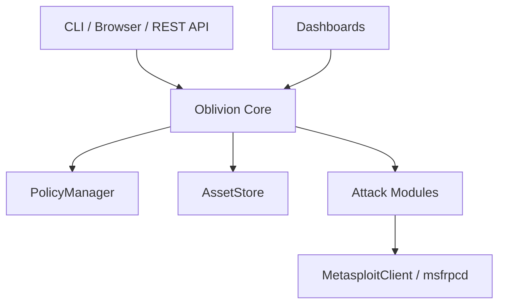

# Architecture

Oblivion is modular and extensible. The main components are:

- **CLI & API** — User interfaces for operation.
- **Oblivion Core** — State, attack planning, scenario runner.
- **Attack Modules** — Each MITRE technique is a class; easy to add custom modules.
- **PolicyManager** — Safety and scope enforcement.
- **AssetStore** — Persists discovered hosts/services.
- **MetasploitClient** — Bridges to msfrpcd for real exploit delivery.
- **Dashboards** — CLI (Rich) and browser (WebSocket/REST).

See [dashboard.md](dashboard.md) for user-facing flows.